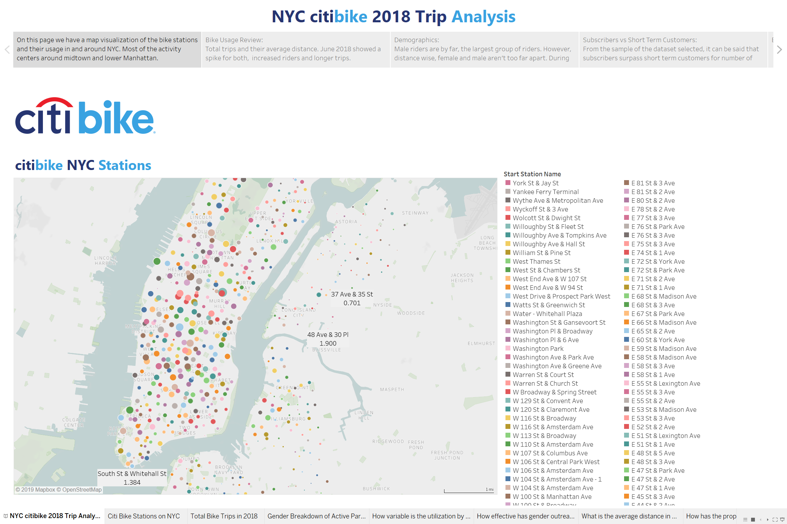

# Tableau Assignment - Citi Bike Analytics 


## Assignment Goal 

My task was to aggregate the data found in the Citi Bike Trip History Logs to build a data story using Tableau. The timespan of the report was 2018. 

Multiple steps were taken to make it happen:

* I downloaded individual months of the data
* Researched several methods to combine the data sets into one table using Pandas
* Cleaned up and normalized the data
* Tested working with all 17 millions rows and discovered that wasn't efficient
* Created a sample of the data containing 10,000 rows for the analysis

# Discoveries

In NYC the popular stations revolve around midtown and lower Manhattan.
There is consistent usage of the bikes from May through October. 
The other months are not as popular as the summer months. Most likely due to the weather.

The demographics results show a large shift towards male riders by a -/+ 75% margin. Females riders maintain an average of 22% to 25% throughout the year.

The age of the riders remains between 36 and 42 years old.
* Average Age = 42
* Minimum Age = 36
* Maximum Age = 51
* Median Age = 40

# Analysis

* Map illustrating the bike stations in the dataset



* CitiBike Usage for the time period selected


* Citi Bike Rider Demographics


* Rider type, Yearly Subscriber vs Short Term Customer


# ETL

Pandas code to combine and normalize the data

```python
# Used dask to combine the multiple CSV files from the citi bike website https://www.citibikenyc.com/system-data
import dask.dataframe as dd
df = dd.read_csv('data/*tripdata.csv', dtype={'end station id': 'float64',
       'start station id': 'float64'})

# Calling the .compute() method to transform a dask.dataframe to a pandas dataframe
df = df.compute()


# Code to select ramdom sample of the data
import random

filename = "data/avgtripduration.csv"
n = sum(1 for line in open(filename)) - 1 
s = 10000 #desired sample size
skip = sorted(random.sample(range(1,n+1),n-s)) 
df = pandas.read_csv(filename, skiprows=skip)

# Method used to create a new column in the df containing the distance
def distance_calc (row):
    start = (row['start_lat'], row['start_long'])
    stop = (row['end_lat'], row['end_long'])

    return vincenty(start, stop * 1).miles

df1['distance'] = df1.apply (lambda row: distance_calc (row),axis=1)

```
